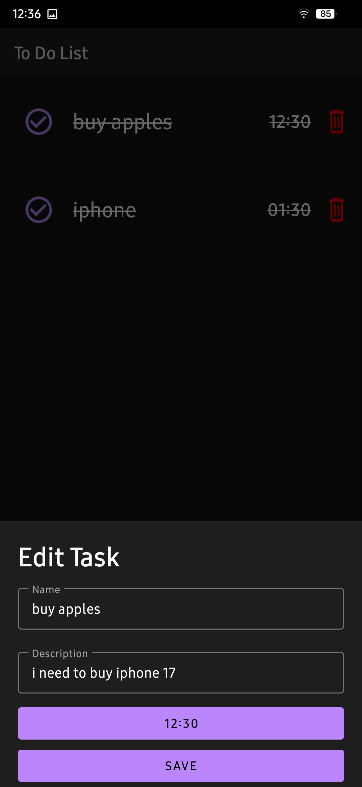

# 🎤 Overview

The To-Do List app is a simple and easy-to-use task manager that helps you stay organized. Whether you need to remember daily tasks, set priorities, or track completed work, this app makes it effortless. With a clean and user-friendly interface, you can quickly add, edit, and manage your to-do list with just a few taps.

## 📝Features

* Add Tasks: Easily create new tasks to keep track of what you need to do.

* Mark as Completed: Check off tasks once you finish them.

* Edit or Delete Tasks: Update or remove tasks as needed.

* Prioritize Tasks: Set importance levels to organize tasks better.

* Simple & Intuitive Design: No complicated menus, just a smooth and straightforward experience.

* Stay on top of your to-do list and manage your tasks effortlessly!

## 📷Screenshots

| Description  | Light Mode | Dark mode |
| ------------- | ------------- | ------------- |
| Home screen |   |  |
| Add New Task  |   |   |
| Set Time  |   |  |
| Edit Task  |  |   |
